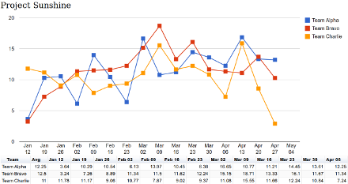

Toggl time report builder
=========================

Toggl.py is a time report builder, taking data from [Toggl](toggl.com) time 
tracker using [reports API](https://github.com/toggl/toggl_api_docs/blob/master/reports.md).

It was created for internal use by the Software Engineering program and tailored 
for academic purposes. However, I will be glad to hear it is used in industry as well.

At the moment three types of reports are available:

- team report, charts with weekly teams effort
- team report aggregated by weeks/teams, CSV file
- individual report aggregated by weeks/projects, CSV file
- time logging violations, CSV
- detailed report with all logged entries, CSV

Requirements
----

The only requirement is Python 2.4+ (Python 3 compatible).

This tool does not use any external libraries. It does not use any kind of 
database or local storage to store past data, report is completely rebuilt for 
the given period every time. It introduces ~30 seconds of overhead per 10K records 
report period, which were sacrificed for tool portability and ease of use.

Setup
----

Get the code:

`git clone git@github.com:user2589/Toggl.py.git`

Then, adjust settings. There is an example settings file you can use as a template:

`mv settings.exapmple.py settings.py`

Following settings available:

- `api_token` - Toggl api token, you can find it in [toggl profile](https://toggl.com/app/profile). 
Good practice is to create a separate account with access to all monitored teams' 
workspaces.
- `start_date` and `end_date` - boundaries of the period monitored in `YYY-MM-DD` 
format. In academia we use semesters, for industry use you might consider quarters. 
- `report date format` - data format to be used to name Mondays in weekly time report

Detailed report
-----------

Detailed report is a CSV file with columns: user, team, project, start, duration. 
To generate the detailed report, run:

    ./detailed_report > detailed.csv

If you serve CSV reports over the web, there is a nice visualization of the 
detailed report (check out the [screenshot](docs/Details.png)). Just put `detais.html` 
into the same folder as CSV files, under the webroot directory of the HTTP server. 
Usually, it is a good idea to restrict access to detailed and individual reports 
for privacy purposes, e.g. by using [htpasswd](https://httpd.apache.org/docs/2.4/programs/htpasswd.html) 
file for Apache2

Individual report
-----------

Individual report is a CSV file, generated from detailed report by aggregating 
records by users and reporting weeks.

Example individual report opened in LibreOffice:

To produce this report, run:

    # if you already have a detailed report
    cat detailed.csv | ./individual_report.py > individual.csv 
    # .. or, if you don't
    ./detailed_report | ./individual_report.py > individual.csv 
    # .. or, generate both
    ./detailed_report | tee detailed.csv | ./individual_report.py > individual.csv 

Logging violations report
-----

This report is a CSV list of suspicious time entries. It is generated by the 
script of individual report and printed to standard error output. What is 
treated as violation:

- overlapping time entries
- time entry stretching more than N hours (10 by default)
- time records without project

An example of violations report opened in LibreOffice:
    

To produce this report, run:

    # to produce logging violations report only
    cat detailed.csv | ./individual_report.py 2> violations.csv 
    # to produce both individual and violation reports at once
    cat detailed.csv | ./individual_report.py  > individual.csv 2> violations.csv 
    # if you want to generate all three reports (detailed, individual and violations)
    ./detailed_report.py | tee detailed.csv  | ./individual_report.py 2> violations.csv > individual.csv

Team report
-----------

Team report is a CSV file similar to the individual one but aggregated by teams.

Example of the report produced with default template:

To produce the report, run:

    # from individual report
    cat individual.csv | ./team_report.py > team.csv    
    # or, all reports at once
    ./detailed_report.py | tee detailed.csv  | ./individual_report.py 2> violations.csv \
        | tee individual.csv | ./team_report.py > team.csv
    
Also, there is a visualization of the team report. Just put the team CSV report 
into the same folder as `team.html` under your webserver root. The `team.html` 
is a static HTML file which uses Ajax to get CSV report data and 
[Google Charts](https://developers.google.com/chart/) to produce a picture like this:

    
Also, look of the charts is adjustable via template settings (check the source of the `team.html`: 

    var settings = {
        report_path: 'team.csv', // don't forget to update this one!
        chart_options: {
            chartArea: {left:'5%',top:'5%',width:'75%',height:'85%'},
            vAxis: {baseline: 0},
            pointShape: 'square',
            pointSize: 15,
            width: 1100,
            height: 430
        },
        // .... more settings
    }
    
License
-------

Distributed under the [MIT License](opensource.org/licenses/MIT)
